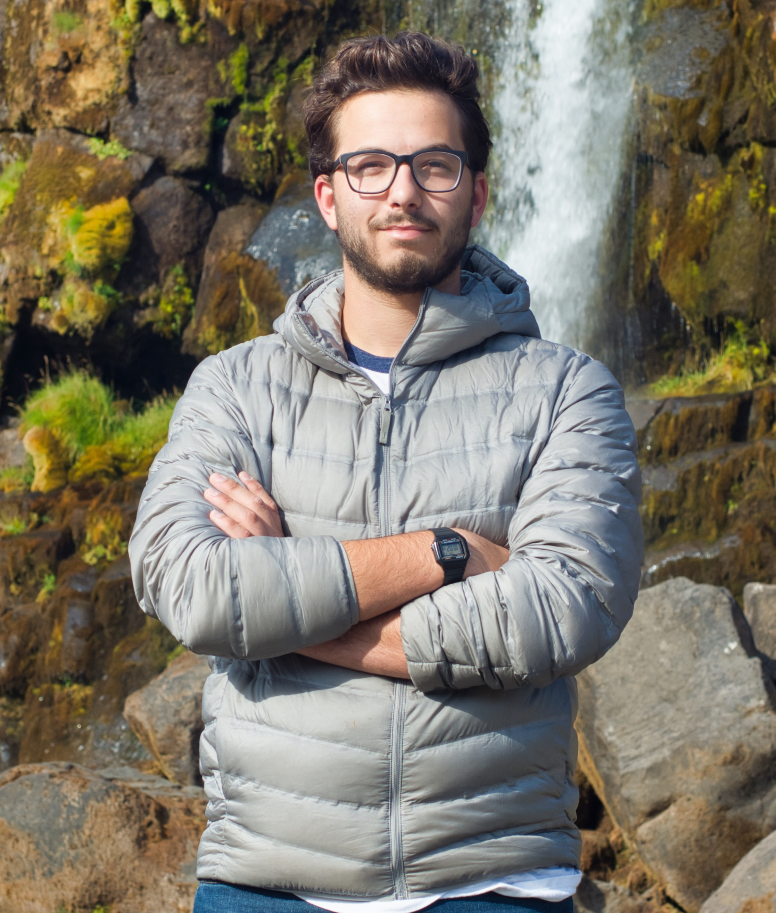

# Welcome to my Portfolio!

My [CV](ZCurtisGinsbergCV.pdf)

[editor on GitHub](https://github.com/zcurtisginsberg/zcurtisginsberg.github.io/edit/main/README.md)

## About Me

I'm a sometimes physicist, sometimes artist working out of the Chicago area. My focuses in science lie in the exploration of the universe through the detection of astrophysical particles. My interests in art revolve around teaching science, usually physics, in new and creative ways. I do this through creative coding projects, some of which are shown below.

## Physics

I am a part of the Beamforming Elevated Array for COsmic Neutrinos (BEACON) experiment and the Radio Neutrino Observatory - Greenland (RNO-G) experiment. These experiments are using novel techniques to detect radio-wave air showers created by astrophysical neutrinos when they interact in the earth (specifically in the earth's crust or glacial ice). I am currently developing the next-generation all-Terrain Data AcQuisition system (TerraDAQ) for the BEACON experiment. My code developed for BEACON can be found [here](../beaconzach). I am also preparing to travel to [Summit Station](https://geo-summit.org/) this summer for the next deployment season for RNO-G.

## Art

My artistic pieces have focused on teaching science, primarily physics, through creative coding and innovative ideas. I believe anyone can learn science, but most science is taught in the same way everywhere, and some people struggle to connect with those teaching methods. So I've been creating tools to teach science, and to let people have fun while they learn.

### Air Showers with Tennis Balls

Back in 2021 I created an installation exhibit where people could come and create 'air showers' by throwing tennis balls. My intention was to display how astrophysical particles hitting our atmosphere creates a large 'shower' of other particles and electromagnetic waves, and to do that in a fun way. Unfortunately, due to the Covid-19 pandemic, I have yet to show this piece in a public space. I do have a short [video](https://drive.google.com/file/d/1GFAfDlxvOEQzTHQlqI7LPblpn8TjaN4Q/view) showcasing the piece, and I hope to install it at some point soon.

### Index of Refraction
Later in 2021 I created 

### Radio Wave Hacking
I am currently working on 
